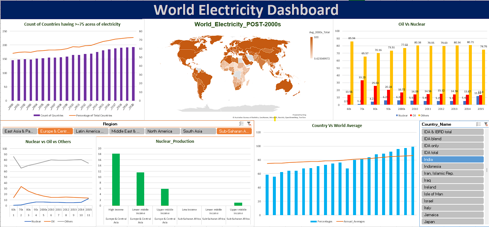

# World Electricty Analysis

The project contains the World Bank report on the Access of Electricity throughout different years. The final output of this project was to analyze the data and derive meaningful insights from it. The results were then presented in the form of a dashboard.

## Dashboard

### Software and Tools Requirements

1. [Github Account](https://github.com)
2. [VSCodeIDe](https://code.visualstudio.com/)
3. [GitCLI](https://git-scm.com/downloads)
4. [Python](https://www.python.org/downloads/)
5. [Excel](https://www.office.com/)
6. [Ms Sql](https://www.microsoft.com/en-in/sql-server/sql-server-downloads)
7. [Pandas](https://pandas.pydata.org/docs/getting_started/install.html)
8. [Numpy](https://numpy.org/install/)
## User's Manual

| Files/Folder             | Description                                                                |
| ----------------- | ------------------------------------------------------------------ |
| Json Data |It contains the raw data files in JSON format. |
| Py | It contains the python code of the data cleaning part. |
| Cleaned_CSV | This provies the csv files after data cleaning.|
| SQL |This provides SQL queries of the aggregation of the data.|
| Dashboard.xlsx |The final output of this project, presented in the form of a dashboard, provides meaningful insights derived from the analyzed data.|
| Dashboard.pptx|For better understanding of project please go through the ppt.|

## Quick Steps

- Json Data folder all file is in Raw JSON format. Go through the Metadata file,  it will provide you the quick information about the data.
- Use Py folder [.ipynb](https://github.com/Supriyam-Mishra/World-Bank-Electricity/tree/main/Py) to clean the JSON data and convert it into CSV format. (Use Jupiter Notebook for it.)
- After getting the cleaned CSV file, Use Sql folder's [Query.sql](https://github.com/Supriyam-Mishra/World-Bank-Electricity/blob/main/SQL/Query.sql) file to perform the aggregations.
- Copy the outputs of aggregation into [Excel File](https://github.com/Supriyam-Mishra/World-Bank-Electricity/blob/main/Dashboard.xlsx) and build an Interactive Dashboard.
- Please go through [PPT File](https://github.com/Supriyam-Mishra/World-Bank-Electricity/blob/main/Dashboard.pptx) for better understanding of our Work.

 

# Hi, I'm Supriyam Mishra! 👋

## 🚀 About Me
I'm a Data Analyst Enthusiast, have honed my skills in data analysis, visualization,
and machine learning. With hands-on experience in Python, SQL, Excel, and PowerBI, 
I am proficient in extracting insights and delivering data-driven solutions. My 
passion for data-driven decision making and problem-solving is evident in my work. 

## 🔗 Links

## 🛠 Skills
Excel (Knowledge of Lookups, Pivot Tables, Pivot
charts and Dashboard),
Python (Knowledge of EDA and libraries like Pandas,
Numpy, Matplotlib),
SQL (Knowledge of Database principles, Joins, Subqueries, Aggregate functions, Unions),
PowerBI (Analytical & Visualization Skills, Designing
interactive charts, graphs, plots and dashboards),
Machine Learning (Basics of Machine Learning, EDA,
Data wrangling, Model training, Regression,
Classification)

                                        